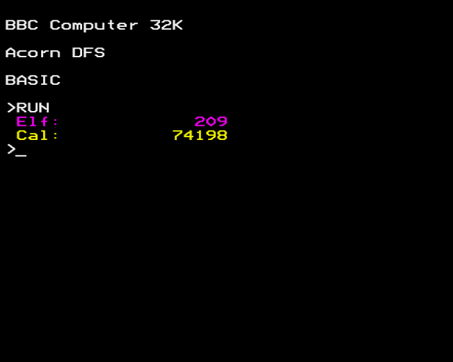
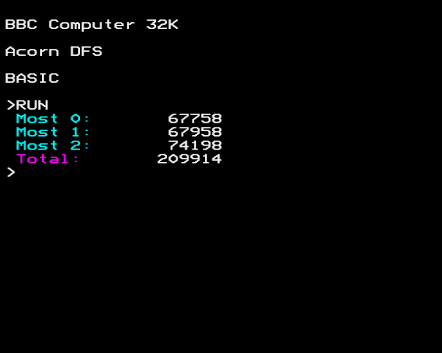
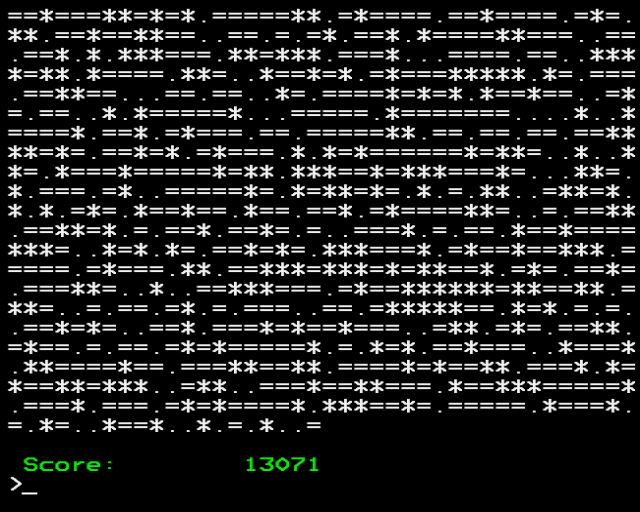

# advent-of-code-2022

An optimistic attempt to solve [Advent of Code 2022](https://adventofcode.com/2022) using an emulated BBC Micro Computer.

I'm using the [Owlet BBC BASIC editor](https://bbcmic.ro/) for now - although if the data grows by much for some of the later challenges I'll probably have to switch to something where I can provide a disk image.

For now, you can copy/paste the code for each solution into the Owlet editor, and hit the run button to see it working...

## Solutions

| Solution A | Solution B |
|-|-|
|  [01A-solution.basic](2022-12-01/01A-solution.basic) |  [01B-solution.basic](2022-12-01/01B-solution.basic) |
| 2022-12-02/02A-running.mov  [02A-solution.basic](2022-12-02/02A-solution.basic) |  [02B-solution.basic](2022-12-02/02B-solution.basic) |

## The Beeb

The BBC Micro (affectionately known as the Beeb) is a computer first released by the BBC in 1981. Soon after, they appeared in every school. I was also released in 1981, and I have a bit of a soft spot for these old 8-bit machines.

My brother and I grew up writing little games and programs for them in BBC BASIC.
