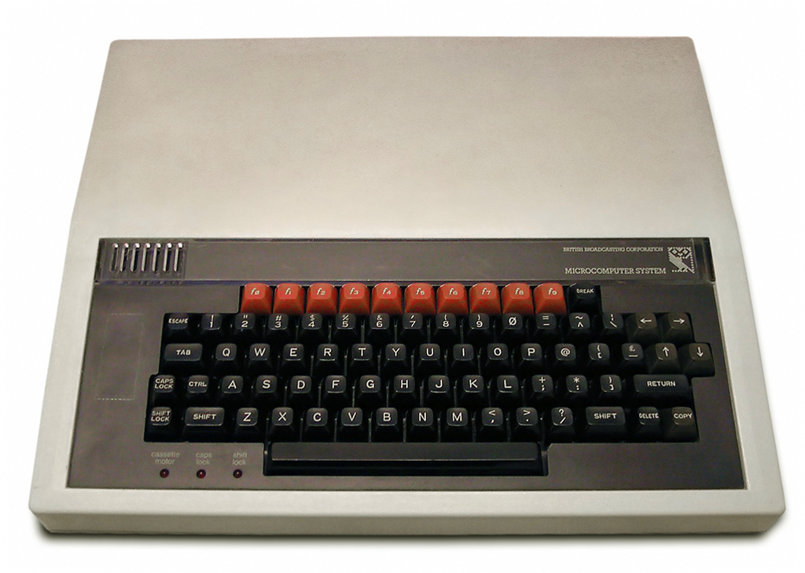

# advent-of-code-2022

An optimistic attempt to solve [Advent of Code 2022](https://adventofcode.com/2022) using an emulated BBC Micro Computer.

## Solutions

| Solution A | Solution B |
|-|-|
|  [01A-solution.basic](2022-12-01/01A-solution.basic) |  [01B-solution.basic](2022-12-01/01B-solution.basic) |

